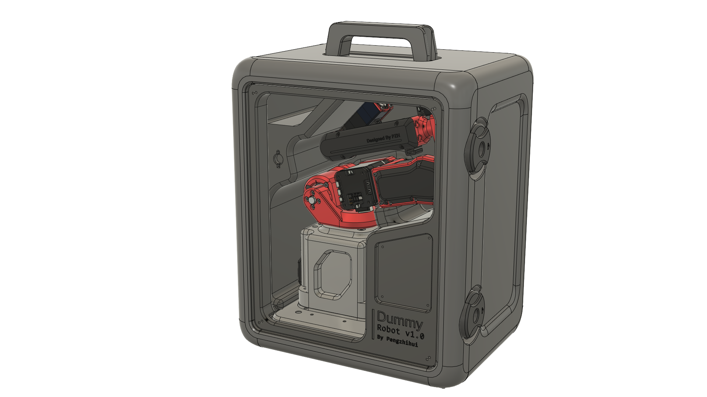
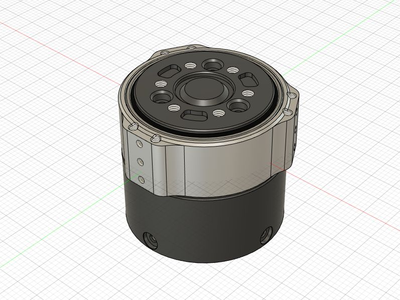
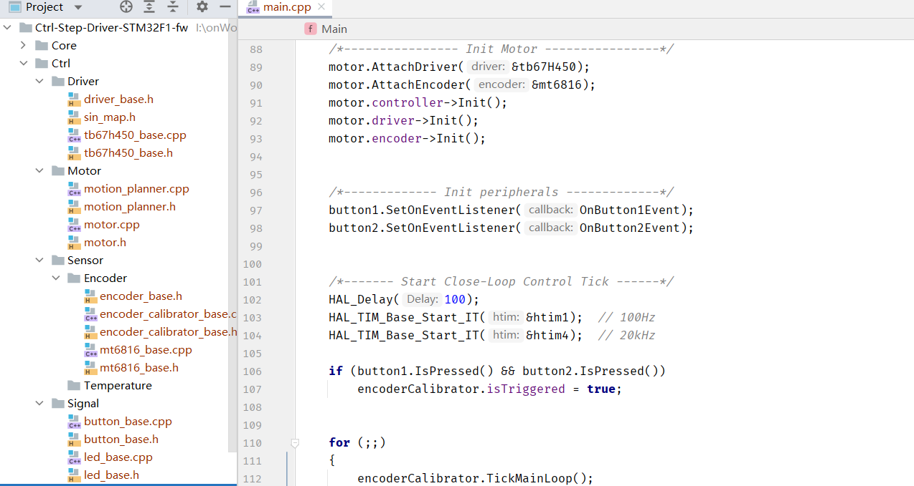
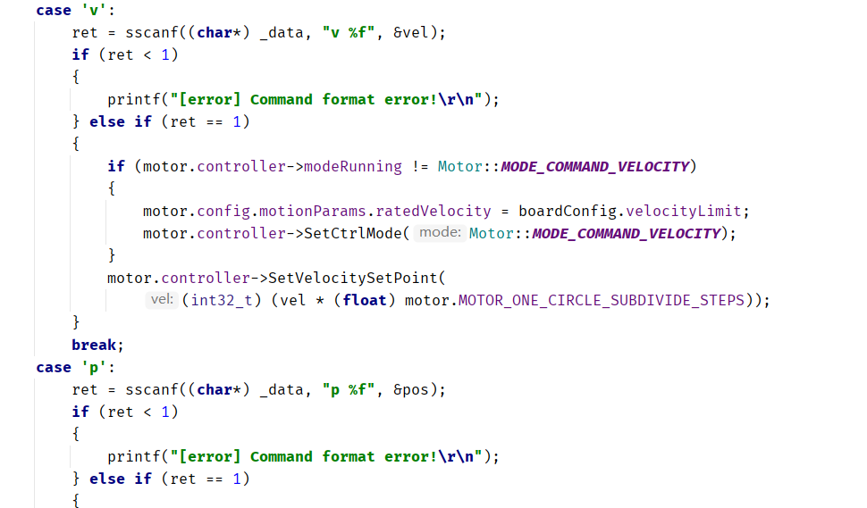
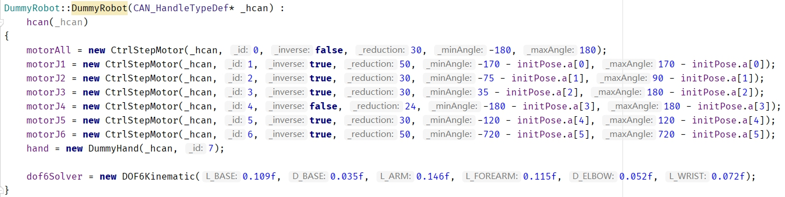
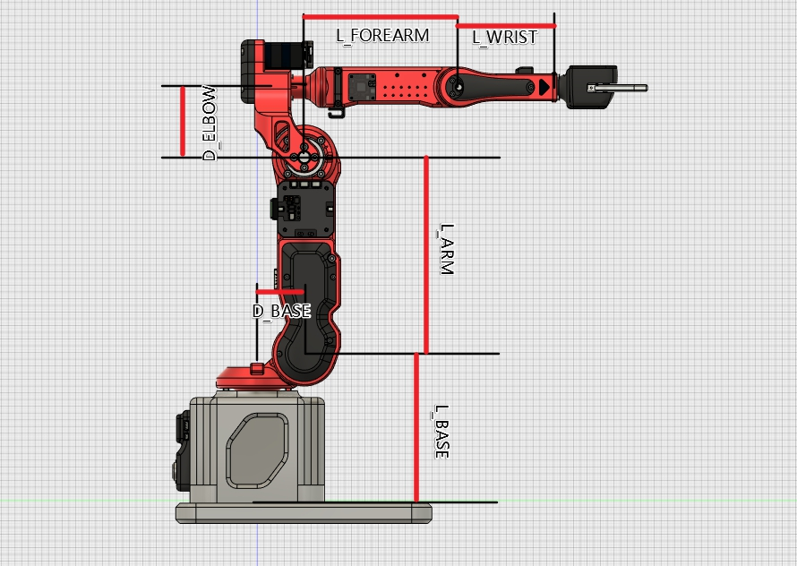

# Dummy-Robot: Super compact smart robotic-arm
> **我的超迷你机械臂机器人项目。**
>
> 视频介绍：[【自制】我造了一台 钢 铁 侠 的 机 械 臂 ！【硬核】](https://www.bilibili.com/video/BV12341117rG)
>
> Video : [I made a DUMMY ROBOTIC ARM from scratch！ - YouTube](https://www.youtube.com/watch?v=F29vrvUwqS4)

### 资料说明（更新日期22-2-9）

* 已添加3D模型设计源文件。
* 已添加夹爪硬件设计文件和LED灯环PCB
* 已添加无线空间定位控制器PCB文件
* 已添加无线示教器Peak软硬件工程（作为submodule）
* 已添加REF的硬件设计文件
* 已添加DummyStudio上位机
* 已添加Dummy核心控制器的固件源代码（使用说明见后文）
* 已添加42步进电机驱动器硬件工程
* 已添加20步进电机驱动器硬件工程
* 已添加42/20步进电机驱动的固件源代码
* 已添加命令行调试工具reftool（基于odrivetool框架）
* 已添加便携手提箱的模型文件

> 这是视频中原版机械臂的完整设计方案，该方案成本和制作难度都比较高，因此想复现的同学建议再等等我后面会发布的**Dummy青春版**，该版本会有如下改进：
>
> 1. 整机重新设计结构，改用3D打印作为制造方案（原版为铝CNC），大幅降低制造成本
> 2. 采用我自己设计的小型摆线针轮减速器替代原版的谐波减速器，大幅降低零件成本
> 3. 所有软件和固件和原版通用，功能也完全一致
> 4. 添加我自己设计的PC端上位机和手机端APP（争取把用户初始化设置引导加进去）
> 5. 改进原版电机驱动器的走线方式，原版电源走线采用焊接的形式，不便于安装和拆卸，后面的青春版会使用4p接插件（电源+CAN总线）连接
> 6. 整机成本争取做到2000以内
> 7. **最重要的，会找人出一个保姆级的视频教程！**

## 关于结构设计

我视频中原版设计使用的`步进电机`+Harmonic的`谐波减速模组`，其中后者成本较高（我买的二手大概是600元一个），因此为了能让大家尽量复现本项目，我后期会添加一个`自制摆线针轮减速器`+`3D打印`的低成本方案。

> 目前摆线减速器已经设计好了正在验证，预期会使用PC（或者亚克力）切割结合3D打印制作，精度有所下降但是功能都保持不变，整机硬件成本希望控制在2000元以内。

设计好的摆线减速器见我的另一个仓库：[peng-zhihui/CycloidAcuratorNano ](https://github.com/peng-zhihui/CycloidAcuratorNano)

## 关于电路模块

电路为了实现主要的机械臂运动控制功能其实核心就4块板子：

* REF核心板
* REF底板（也就是机械臂底座里面的控制器电路板）
* 步进电机驱动
* Peak示教器

其中前两者和Peak我都开源了，步进驱动设计的时候参考了： https://github.com/unlir/XDrive 这个项目，这是我一个朋友开源的闭环驱动，基于STM32。该驱动分为开源版和闭源版，闭源版基于分立MOSFET性能极其强劲且功能很完善，开源版用的ADC+斩波驱动芯片，具备基础功能，不带CAN协议。

我重新设计了驱动器的PCB电路（本项目分别用到20、42步进，57的文件只是供大家扩展使用），添加了CAN总线的硬件支持，也对原版核心代码进行了完全重构，**提供编译好的二进制文件可以直接烧录：**

**主要改进如下：**

1. 使用C++11重构了代码，引入很多高级语言特性，同时底层部分用C混编，不影响代码性能
2. 对硬件依赖完全解耦了，可以方便以后移植到其他平台的MCU，去除了冗余代码代码也结构化逻辑更加清晰
3. 添加了CAN协议和UART协议的自定义模板
4. 添加了模拟EEPROM的参数储存，可以断电保存数据
5. 添加了任意位置设置为零点，且保证双向半圈内归零（而不是单向归零）
6. 完全兼容STM32-HAL库，可以使用STM32CubeMX直接生成配置代码
7. 其他改进，大家二次开发仅需关注UserApp文件夹下的文件即可

Ctrl-Step驱动的使用方式比较简单，下载好固件后，第一次上电电机会进行编码器校准，如果成功则下次上电后按下按键1会进入闭环模式，通过CAN或者串口发送指令即可控制电机，关于指令的说明见源代码`UserApp`文件夹的`interface_can.cpp`和`interface_uart.cpp`：

> 其他按键的作用：
>
> * 同时按住两个按键上电，会自动进行编码器校准，如果首次校准失败可以通过这个方式重新校准
> * 短按按键1在**使能闭环/失能闭环**间切换
> * 长按按键1板子重启
> * 短按按键2清除堵转保护
> * 长按按键2将目标值归零（比如如果是在位置模式那位置会归零）
>
> 其他的功能要通过代码或者通信协议设置，比如设置**home零点**、**PID参数**、CAN节点ID、**各种运动参数**等等，可以自己研究代码。

当然另一种方式是大家也可以自行使用GRBL类的驱动器改装用来驱动本机械臂，这样方案的问题在于，grbl固件耦合性比较强（毕竟不是针对机械臂而是CNC类应用设计的）不便于扩展，另外脉冲形式的控制方式使得走线极其不优雅（每一个关节都要单独拉`step/dir`线到控制器，导致最后几个关节走线很长）。

而我用一体闭环的方式则可以以串联的形式把所有电机连起来即可，走CAN总线使得整体走线只需要四根线（电源正负两根，CAN信号线两根），此外总线模型使得电机可以工作在`力矩`、`速度`、`位置`、`轨迹`模式下，而脉冲模式只能工作在位置和轨迹模式，无法进行复杂控制。

**Peak的话我之前已经软硬件都开源了，可以去SubModules文件夹里面看那边的README说明。**

## 关于核心固件

这个机械臂的固件核心就是运动学姿态解算，~~这块我还在整理，后面会封装得更完善一些进行开源~~，**已开源**，现在写死的很多参数会设计成可配置的，**方便大家用本项目学习完后迁移到自己设计的机械臂中**；同时我把固件从LiteOS框架移植到大家更熟悉的FreeRTOS，方便做二次开发。

**REF的固件使用说明：**

固件主要包括几大功能模块：

* BSP驱动：板载的各种硬件驱动比如OLED、IMU、LED、蜂鸣器、非易失储存等等
* 3rdParty库：包括U8G2的图形库和Fibre的序列化/反序列化库
* Core：ST官方的HAL库
* Driver：ARM的CMSIS驱动
* Midwares：FreeRTOS支持包
* Robot：核心机器人库，包括各种算法和驱动代码
* UserApp：上层应用，可以基于我提供的API接口自行开发其他应用

> * 其中OLED使用Arduino的U8G2库移植而来，可以方便地现实各种调试和系统信息，另外由于STM32的硬件I2C又BUG这里使用了软件I2C驱动屏幕，实测帧率比硬件I2C更高。

`DummyRobot`类是Dummy的完整定义所在，初始化的时候需要设置好**步进电机驱动的信息**以及**自身的DH参数**：

其中驱动器信息包含：CAN节点ID、**是否反向**、减速器的减速比、**运动限制范围**。

而DH参数的含义如下：

机械臂的构型需要满足Pieper判据（机器人的三个相邻关节轴交于一点或三轴线平行），才能得出解析解，所以大家可以根据Dummy的结构进行修改，然后自己替换DH参数即可以移植我的代码。

> 关于位置的记忆，和上电零点校准：
>
> **由于绝对值编码器的位置只在一圈内有效，工业机械臂经过减速后为了获取绝对位置一般是做输出端编码，但是这样精度就降低了30倍（减速比），所以更合理的是做`双编码器`或者低`功耗编码器+电池`；而我这个项目中双编码器影响结构紧凑设计，所以用了更巧妙的方式：利用电机驱动的电流环控制上电后进行低力矩的无零点定向运动，碰到机械臂限位之后确认粗零点（无限位开关归零），然后根据单圈绝对值编码器的位置精调零点。这个方式的零点是没有误差的，而且几乎不受加工精度影响，因为在12度（360/30）内都是绝对值编码器的有效精度范围。**

**Peak的固件说明：**

Peak基于X-Track项目，大家可以去Peak仓库查看。

## 关于上位机

视频中的软件仿真基于RoboDK，我在视频中开发了连接Dummy的Driver（驱动部分官方document有介绍的，原版是基于TCP网络接口，我修改成了串口并兼容dummy的协议）。不过由于这个软件是收费的，因此我也基于Unity3D开发了自己的上位机，已经发布在仓库。

上位机目前暂时没有计划开源，因为还有很多功能要添加，我也是希望最后能做成一个类似RoboDK的通用软件，大家以后自己做机械臂也能用上，当然软件肯定会是免费的。

## 关于控制算法

首先运动学部分是已经实现了的，正逆解都是传统DH参数计算的，正解（关节角求末端位姿）是唯一解比较好办，逆解（末端位姿求关节角）的话会涉及多解（一般是8个），我这里使用的算法是**求解上一姿态和目标姿态中6个关节变化最大角里面最小的那一组作为逆解采用的config**。这样可以保证机械臂始终以最小转角进行姿态切换。

然后关节角到电机驱动器输入信号的转换这一块，我使用的是梯形加减速曲线进行速度位置规划。举个例子在MoveJ指令中，当收到一个关节角运动指令，控制器会进行运动角度差分计算，得到6个运动差分角度，然后取6个差分角中最大的角θ，同时根据设置的JointSpeed参数计算运动θ角需要的时间（考虑上加减速），把这一时间作为其余5个电机的运动参数计算各自的加减速度&最高速度，然后6个电机根据计算的参数同步运动，就可以保证其同步性和流畅性了。

另外六个电机使用CAN总线连接，每个电机接受两个ID号的信息（自己的ID、0号ID），0号ID作为信息广播和同步用。电机接收到运动指令后将信息储存在影子寄存器中，待收到广播的同步信号后开始运动，这样能进一步保证电机同步性。

最后，动力学部分还在开发中，这块暂时没有完全实现。上**述的运动学和动力学算法都强烈建议去看一下《机器人学导论》这本书**，里面写得非常详细。

## 指令模式

Dummy固件支持三种不同的指令模式（指令可以由USB、串口、CAN接收），不同模式的特性有所区别，见下表：

|                       | 指令发送频率      | 指令执行方式           | 可被新指令打断 | 指令间停顿 | 适合场景                                                     |
| --------------------- | ----------------- | ---------------------- | -------------- | ---------- | ------------------------------------------------------------ |
| SEQ（顺序指令）       | 随机，低（<5Hz）  | FIFO队列依次执行       | 否             | 有         | 一次性发送几个关键点位姿，等待依次执行，可以确保关键点到达；但是由于关键点之间存在减速到0的过程所以存在一定停顿；适合场景例如**视觉抓取、码垛等应用**。 |
| INT（实时指令）       | 随机，频率不限    | 指令覆盖，立即执行     | 是             | 无         | 用于实时控制，新指令会覆盖正在执行的指令得到立即响应；但是如果一次性发送一系列指令的话则效果会是只执行最后一条；适合场景例如**动作同步**。 |
| `ToDo`TRJ（轨迹跟踪） | 固定，高（200Hz） | 自动插值，固定周期执行 | 否             | 无         | 适合用于需要进行精确轨迹跟踪的应用，速度会放慢；示例场景比如**3D打印、雕刻、绘画等**。 |

---

> **感谢以下项目作者：**
>
> * [unlir/XDrive: Stepper motor with multi-function interface and closed loop function. 具有多功能接口和闭环功能的步进电机。 (github.com)](https://github.com/unlir/XDrive)
> * [odriverobotics/ODrive: High performance motor control (github.com)](https://github.com/odriverobotics/ODrive)
> * [olikraus/u8g2: U8glib library for monochrome displays, version 2 (github.com)](https://github.com/olikraus/u8g2)
> * [samuelsadok/fibre: Abstraction layer for painlessly building object oriented distributed systems that just work (github.com)](https://github.com/samuelsadok/fibre)

