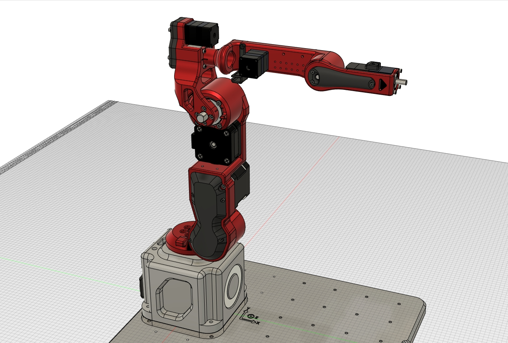

# Dummy-Robot
我的超迷你机械臂机器人项目。

### 资料待整理

* 已添加3D模型设计源文件。
* 已添加夹爪硬件设计文件和LED灯环PCB
* 已添加无线空间定位控制器PCB文件
* 已添加无线示教器Peak软硬件工程（作为submodule）
* 已添加REF的硬件设计文件
* 已添加DummyStudio上位机

## 关于结构设计

我视频中原版设计使用的步进电机+harmonic的谐波减速模组，其中后者成本较高（我买的二手大搞600元一个），因此为了能让大家尽量复现本项目，我希望后期能添加一个**同步轮轮减速+3D打印**或者**行星减速+3D打印**（其实行星减速也不便宜而且从背隙的角度来看还不如同步轮）的方案，如果有同学有结构设计能力的也欢迎自行设计，提交pull request~

## 关于电路模块

电路为了实现主要的机械臂运动控制功能其实核心就4块板子：

* REF核心板
* REF底板也就是机械臂底座里面的控制器电路板
* 步进电机驱动
* Peak示教器

其中前两者我都开源了，步进驱动设计的时候参考了：https://github.com/unlir/XDrive这个项目，这是我一个朋友开源的闭环驱动，基于STM32。该驱动分为开源版和闭源版，闭源版基于分立MOSFET性能极其强劲且功能很完善，开源版用的ADC+斩波驱动芯片，具备基础功能，不带CAN协议。需要的话大家可以自行研究，（另外他家有淘宝店可以直接买闭源成品，非常推荐）。

当然另一种方式是大家也可以自行使用GRBL类的驱动器改装用来驱动本机械臂。

**Peak的话我已经软硬件都开源了，可以去SubModules文件夹里面看那边的README说明。**

## 关于固件

这个机械臂的固件核心就是运动学姿态解算，这块我还在整理，后面会封装得更完善一些进行开源，现在写死的很多参数会设计成可配置的，**方便大家用本项目学习完后迁移到自己设计的机械臂中**。

Peak的固件基于X-Track项目，大家可以去Peak仓库查看。

## 关于上位机

视频中的软件仿真基于RoboDK，我在视频中开发了连接Dummy的Driver（驱动部分官方document有介绍的，原版是基于TCP网络接口，我修改成了串口并兼容dummy的协议）。不过由于这个软件是收费的，因此我也基于Unity3D开发了自己的上位机，已经发布在仓库。

上位机目前暂时没有计划开源，因为还有很多功能要添加，我也是希望最后能做成一个类似RoboDK的通用软件，大家以后自己做机械臂也能用上，当然软件肯定会是免费的。

## 关于控制算法

首先运动学部分是已经实现了的，正逆解都是传统DH参数计算的，正解（关节角求末端位姿）是唯一解比较好办，逆解（末端位姿求关节角）的话会涉及多解（一般是8个），我这里使用的算法是**求解上一姿态和目标姿态中6个关节变化最大角里面最小的那一组作为逆解采用的config**。这样可以保证机械臂始终以最小转角进行姿态切换。

然后关节角到电机驱动器输入信号的转换这一块，我使用的是梯形加减速曲线进行速度位置规划。举个例子在MoveJ指令中，当收到一个关节角运动指令，控制器会进行运动角度差分计算，得到6个运动差分角度，然后取6个差分角中最大的角θ，同时根据设置的JointSpeed参数计算运动θ角需要的时间（考虑上加减速），把这一时间作为其余5个电机的运动参数计算各自的加减速度&最高速度，然后6个电机根据计算的参数同步运动，就可以保证其同步性和流畅性了。

最后，动力学部分还在开发中，这块暂时没有完全实现。

 

